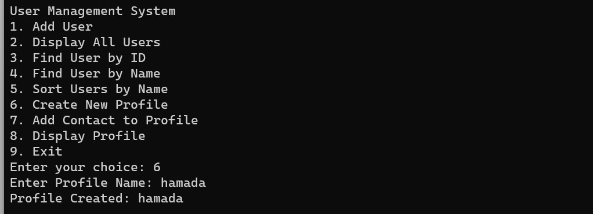

# Console Management System

## Introduction

This Console Management System is a robust, command-line interface application designed for managing users and profiles efficiently. It offers functionalities like creating, adding, and deleting users and profiles, providing a streamlined experience for user management tasks.

## Features

- **User Management**: Add, display, and find users by name or ID.
- **Profile Management**: Create profiles and associate users with them.
- **Data Persistence**: Store and retrieve user data effectively.
- **Sorting and Searching**: Sort users by name and search for specific details.

## Screenshots

Below are some screenshots from the Console Management System, showcasing its features and user interface:

## Getting Started

### Prerequisites

- Ensure you have a modern C++ compiler (C++11 or later).
- Basic knowledge of command-line operations.

### Installation

1. Clone the repository:

git clone https://github.com/abdelrahmangasser555/contact_sys.git

2. Navigate to the project directory:

cd <you project directory name>

3. Compile the source code (example using g++):

4. Run the application:

## Usage

After starting the Console Management System, follow the on-screen prompts to manage users and profiles. The menu options are straightforward and guide you through different functionalities.

## Contributing

Contributions to the Console Management System are welcome! Please read `CONTRIBUTING.md` for details on our code of conduct and the process for submitting pull requests.

## License

This project is licensed under the [MIT License](LICENSE) - see the `LICENSE.md` file for details.

## Acknowledgments

- Mention any inspirations, code snippets, etc.

